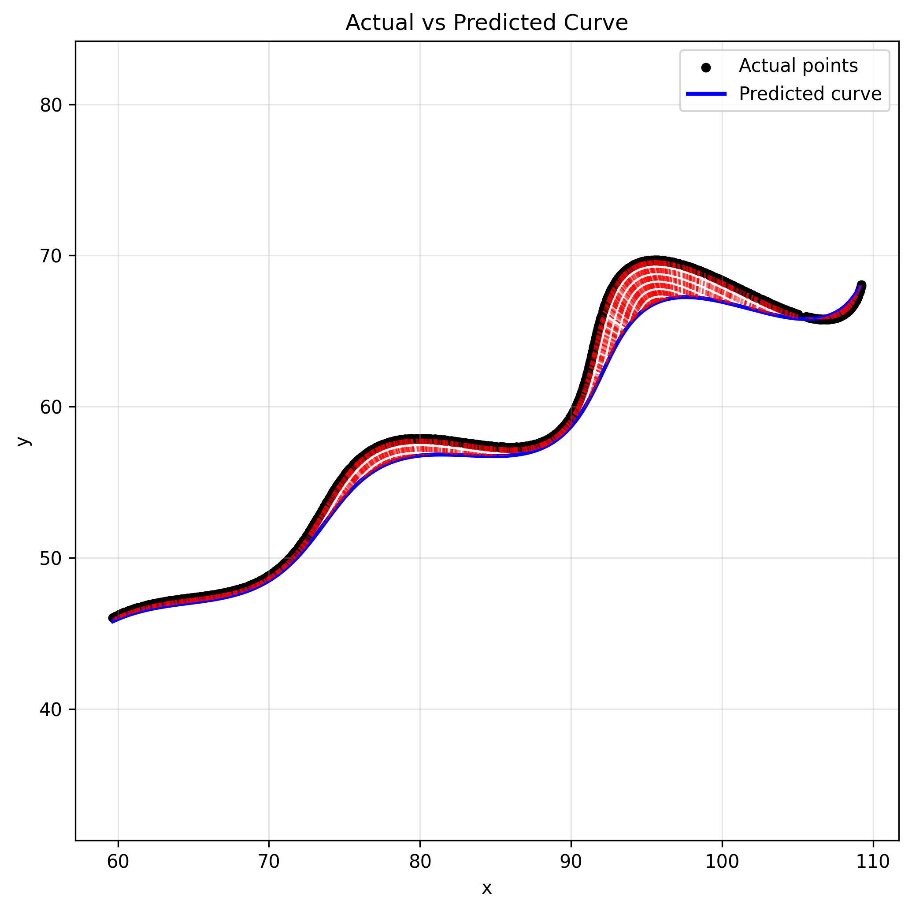

# 🎯 Research and Development / AI – Parametric Curve Fitting Assignment

## Final Estimated Parameter Values (Best Fit)

(These were found by minimizing the **mean L1 error** between observed points and the parametric curve sampled at the given *t* values.)

| Symbol | Values            |
|:-------:|:----------------:|
| θ (rad) | 0.492161         | 
| θ (°)   | 28.2139          | 
| M       | 0.021583         |
| X       | 54.916793        |

---

## Fitted Parametric Curve

The best-fit parametric equation of the curve is:

\[
\left(
t\cos(0.492161) - e^{0.021583|t|}\cdot\sin(0.3t)\sin(0.492161) + 54.916793,\;
42 + t\sin(0.492161) + e^{0.021583|t|}\cdot\sin(0.3t)\cos(0.492161)
\right)
\]

(You may also express the angle in degrees:  
\(\theta = 28.2139^\circ\))

---

## Step-by-Step Process

### 1. Inspecting the Data
- Given `xy_data.csv` with (x, y) pairs — 1500 samples
- Problem states points come from the curve for \(6 < t < 60\)
- So we assume uniformly sampled:

\[
t = \text{linspace}(6, 60, N)
\]

---

### 2. Model Equations

\[
\begin{aligned}
x(t) &= t\cos(\theta) - e^{M|t|}\sin(0.3t)\sin(\theta) + X \\
y(t) &= 42 + t\sin(\theta) + e^{M|t|}\sin(0.3t)\cos(\theta)
\end{aligned}
\]

---

### 3. Loss Function

\[
L = \frac{1}{N} \sum ( |x - x_{obs}| + |y - y_{obs}| )
\]

L1 loss is used because assignment uses L1 distance for scoring.

---

### 4. Optimization Method

- **Differential Evolution** → global search
- **L-BFGS-B** → local refinement
- Bounds respected:

| Parameter | Range |
|----------|------|
| \(0^\circ < \theta < 50^\circ\) | (0, 0.87266 rad) |
| \(-0.05 < M < 0.05\) | exponential modulation |
| \(0 < X < 100\) | horizontal shift |

---

### 5. Metrics

| Metric | Value |
|--------|-------|
| Mean L1 per point | ~25.18 |

---

## ✅ Python Code Used

```python
import numpy as np
import pandas as pd
from scipy.optimize import differential_evolution, minimize
from scipy.spatial import cKDTree
import matplotlib.pyplot as plt

CSV_PATH = "xy_data.csv"
T_MIN, T_MAX = 6.0, 60.0

BOUNDS = [
    (np.deg2rad(0.0 + 1e-3), np.deg2rad(50.0 - 1e-3)),
    (-0.05 + 1e-3, 0.05 - 1e-3),
    (0.0 + 1e-3, 100.0 - 1e-3),
]

WARM_START = np.array([0.492161, 0.021583, 54.916793])
np.random.seed(42)

df = pd.read_csv(CSV_PATH)
x_obs = df["x"].to_numpy(float)
y_obs = df["y"].to_numpy(float)
n = len(df)
t_vals = np.linspace(T_MIN, T_MAX, n)

def predict(params, t):
    theta, M, X = params
    base = np.exp(M*np.abs(t)) * np.sin(0.3*t)
    x = t*np.cos(theta) - base*np.sin(theta) + X
    y = 42 + t*np.sin(theta) + base*np.cos(theta)
    return x, y

def objective(params):
    x_p, y_p = predict(params, t_vals)
    return np.mean(np.abs(x_p - x_obs) + np.abs(y_p - y_obs))

res_de = differential_evolution(objective, BOUNDS, seed=42, maxiter=200)
res_local = minimize(objective, res_de.x, bounds=BOUNDS, method="L-BFGS-B")

theta_opt, M_opt, X_opt = res_local.x
print("theta (rad):", theta_opt, "theta (deg):", theta_opt*180/np.pi)
print("M:", M_opt, "X:", X_opt)

x_pred, y_pred = predict([theta_opt, M_opt, X_opt], t_vals)

pred_pts = np.column_stack([x_pred, y_pred])
data_pts = np.column_stack([x_obs, y_obs])
tree = cKDTree(pred_pts)
dists, idx = tree.query(data_pts, k=1)
nearest = pred_pts[idx]

plt.figure(figsize=(7,7))
plt.scatter(x_obs, y_obs, s=18, label="Actual points", color="black")
plt.plot(x_pred, y_pred, lw=2.2, label="Predicted curve", color="blue")

for (ax, ay), (px, py) in zip(data_pts, nearest):
    plt.plot([ax, px], [ay, py], "--", lw=0.8, color="red", alpha=0.5)

plt.axis("equal")
plt.legend()
plt.grid(alpha=0.3)
plt.title("Actual vs Predicted Curve")
plt.savefig("actual_vs_predicted.png", dpi=300, bbox_inches='tight')
plt.show()
```
---

## Visualization

- **Observed vs Predicted Points:**  
  Shows how closely the fitted curve matches the actual data.
  


- **Desmos Plotting of Equation with our Predicted Parameter:** 
  
